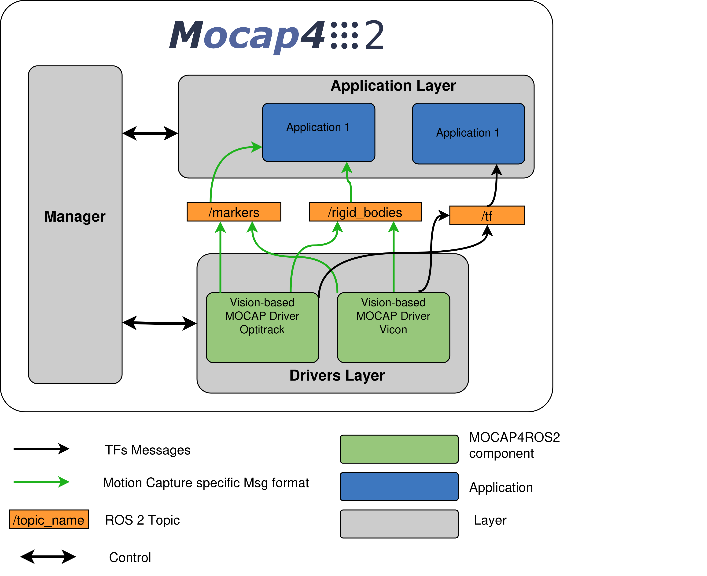

.. _design:

Mocap4r2 design
#################
Overview
--------
The MOCAP4ROS2 framework follows a modular design based on a **layered architecture**. This structure allows easy integration of different types of motion capture systems, supporting vision-based, IMU-based, and other movement or position capture systems. Each layer is responsible for specific functionalities, ensuring that the framework can be easily extended and applied to various motion capture applications.

Key Design Components
----------------------
1. **Drivers Layer**: 
   - This layer contains the ROS 2 drivers that interface with motion capture systems, whether camera-based (like Vicon, Optitrack) or IMU-based systems.
   - Each driver publishes motion capture data in a standardized format, ensuring compatibility across different systems.

   .. code-block:: none

      Example Message Format for Vision-based Systems:
      - Marker Message: 
          * id_type: Defines the type of identifier used.
          * marker_index: Index of the marker.
          * marker_name: Optional name of the marker.
          * translation: Position in space.
      - Rigid Body Message:
          * pose: Position and orientation of the object.

2. **Application Layer**:
   - This layer provides tools for applications that make use of the data produced by the lower layers. It can be used for tasks such as visualization, control, and data collection.
   - Applications in this layer can be reused across different types of motion capture systems.

3. **Manager**:
   - The Manager application controls system startup, synchronization, and data logging. It ensures that multiple motion capture systems can be synchronized and their data can be recorded in a standardized format.

Layer Interactions
------------------
Each layer interacts through well-defined **ROS2 topics**. These topics handle the data flow between motion capture systems and applications.

.. code-block:: none

   Example topics:
   - /tf: Transforms between coordinate frames.
   - /markers: Marker data from vision-based systems.
   - /rigid_bodies: Position and orientation of rigid bodies.