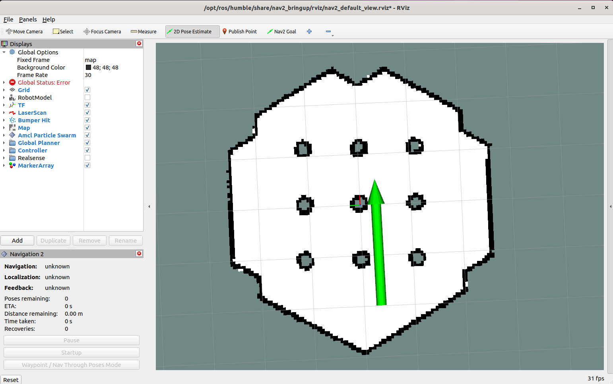
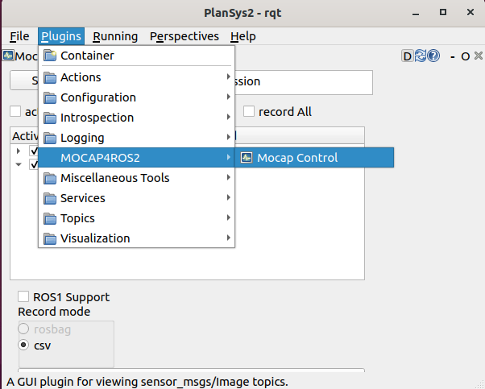

.. _getting_started:

Getting Started
###############

For now, the MOCAP4ROS2 packages are not available as deb packages in any ROS2 distribution, so you must install them from source. The main branches of each repository usually point to the latest distribution available on ROS2.

MOCAP4ROS2 supports motion capture systems, most of which are commercial. Normally, you should now go to one of the sections that explains how to install and configure the particular system you have, but for this "getting started" section, we're going to use the driver for gazebo.

1. Clone in your workspace the following repositories:

.. code-block:: console

    mocap4ros2_ws$ cd src
    mocap4ros2_ws/src$ git clone https://github.com/MOCAP4ROS2-Project/mocap4ros2_gazebo.git
    mocap4ros2_ws/src$ git clone https://github.com/MOCAP4ROS2-Project/mocap.git

2. Install dependencies

.. code-block:: console

    mocap4ros2_ws$ vcs import < mocap/dependency_repos.repos
    mocap4ros2_ws$ rosdep install --from-paths src --ignore-src -r -y

3. Build workspace

.. code-block:: console

    mocap4ros2_ws$ colcon build --symlink-install

4. Run the simulator with "a marker". Remember to use the "2D Pose Estimate" tool in Rviz2 (in toolbar) to set the robot position (it is around (X: -2, Y: -0.5, Yaw: 0.0) ).

.. code-block:: console
    
    mocap4ros2_ws$ ros2 launch gazebo_mocap_plugin tb3_simulation_launch.py

.. |image2| image:: images/getting_started_4b.png
   :width: 400px
   :align: middle

+----------+----------+
| |image1| + |image2| +
+----------+----------+

ru1n `gzclient` if you want to see the simulation.

.. code-block:: console

    mocap4ros2_ws$ gzclient

.. note::
    
    Remember to correctly set the ``GAZEBO_MODEL_PATH`` in order to found the gazebo models. 

    .. code-block:: console
    
        export TURTLEBOT3_MODEL=waffle
        export GAZEBO_MODEL_PATH=$GAZEBO_MODEL_PATH:/opt/ros/humble/share/turtlebot3_gazebo/models
        export GAZEBO_MODEL_PATH=$GAZEBO_MODEL_PATH:/home/<your-user>/mocap4ros2_ws/install/gazebo_mocap_plugin/share/gazebo_mocap_plugin/models/

1. Run RQT Gui and load the MocapControl plugin under "Plugins -> MOCAP4ROS2 -> Mocap Control" 

.. code-block:: console

    mocap4ros2_ws$ ros2 run rqt_gui rqt_gui --force-discover

+----------+
| |image3| +
+----------+

1. Press the button "Start" in MocapControl and check that markers and rigid bodies being published:

.. code-block:: console

    ros2 topic echo /markers

.. code-block:: console

    ros2 topic echo /rigid_bodies

7. Now, lets use an app that takes the rigid body position and orientation, and publishes a TF representing the ground truth of the robot:

.. code-block:: console

    ros2 run mocap_robot_gt gt_program --ros-args -p root_frame:=map

Check in Rviz how a new frame, `base_footprint_gt` exists and is the real robot position. Move the robot and see how this TF track the robot position.

.. |image4| image:: images/getting_started_7.png
   :width: 500px
   :align: middle

+----------+
| |image4| +
+----------+

8. Press the button "Stop" in MocapControl to stop the gazebo mocap.

