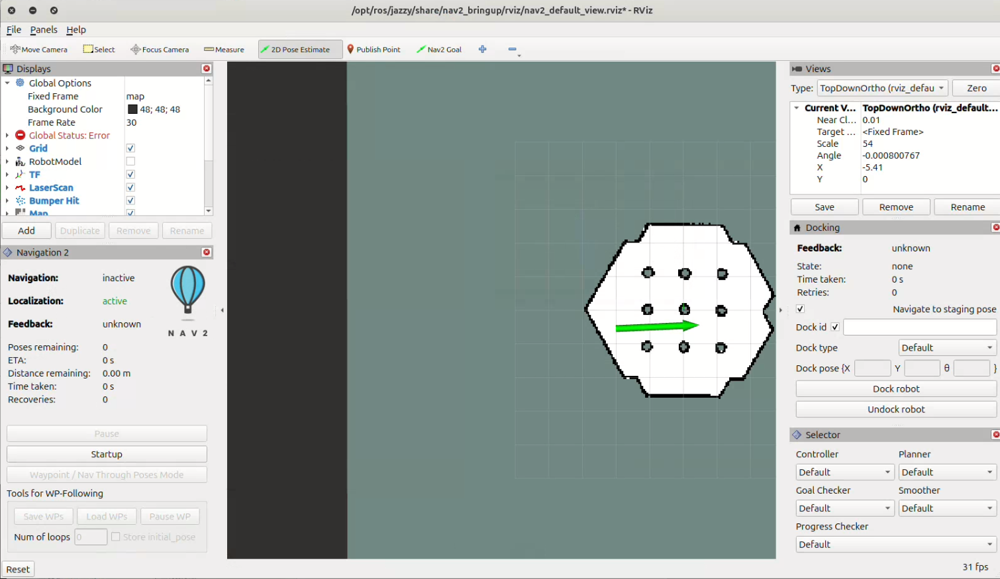
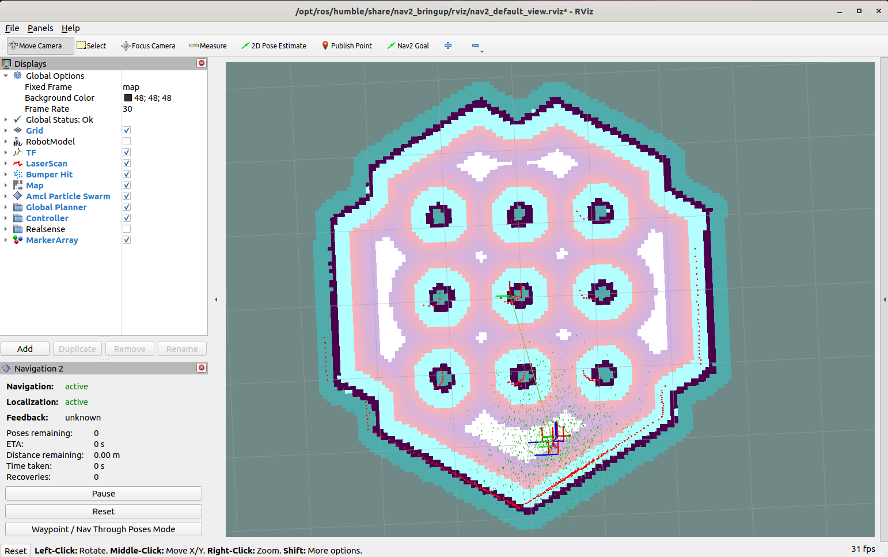
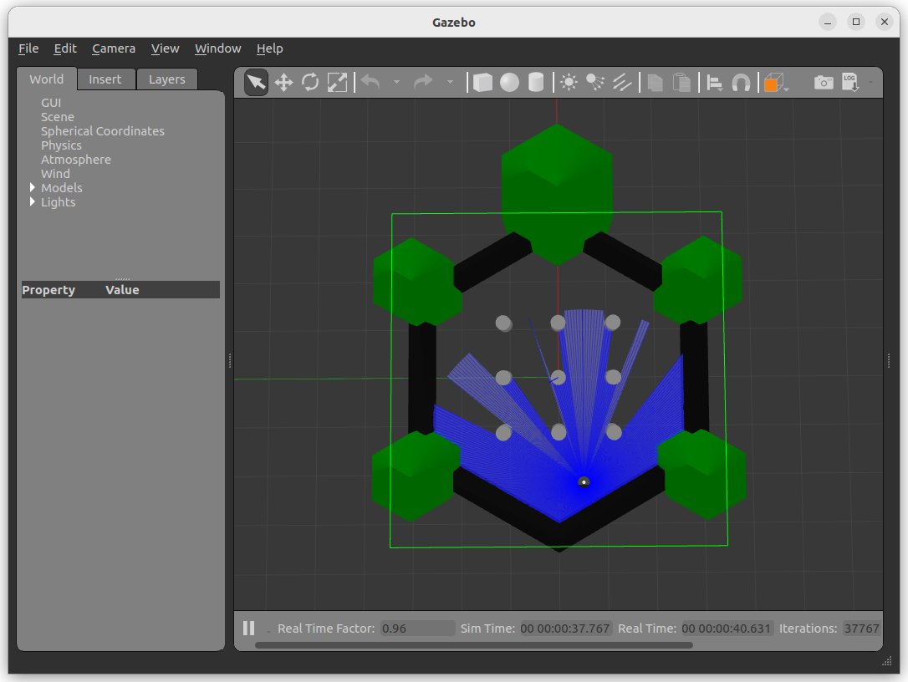
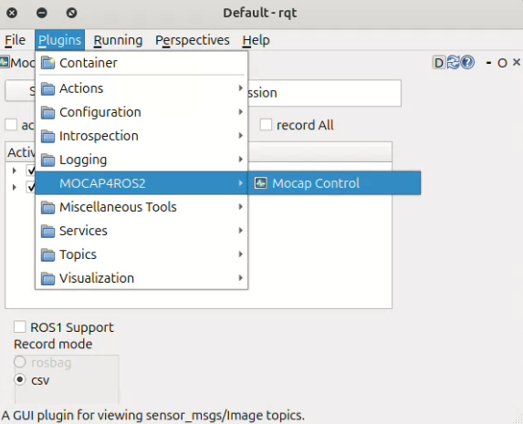

Getting Started
===============================

Currently, the MOCAP4ROS2 packages are not available as Debian packages in any ROS 2 distribution; therefore, you must install them from source. The main branches of each repository are aligned with the Rolling distribution of ROS 2.

MOCAP4ROS2 supports motion capture systems, most of which are commercial. Typically, you should proceed to one of the sections that explain how to install and configure your specific system. However, for this "getting started" section, we will use the driver for Gazebo.

This section provides a step-by-step approach for setting up and running the MOCAP4ROS2 simulation environment. Please follow these instructions carefully to ensure a smooth setup.

.. contents:: Steps
   :local:
   :depth: 1
   :class: toctree

1. Clone the Repositories
-------------------------
Begin by cloning the necessary repositories into your workspace:

.. code-block:: console

    mocap4r2_ws$ git clone https://github.com/MOCAP4ROS2-Project/mocap4ros2_gazebo.git
    mocap4r2_ws$ git clone https://github.com/MOCAP4ROS2-Project/mocap4r2.git

2. Install Dependencies
-----------------------
To install all required dependencies, use the `.repos` file provided:

.. code-block:: console

    mocap4r2_ws$ vcs import < mocap4r2/dependency_repos.repos
    mocap4r2_ws$ rosdep install --from-paths src --ignore-src -y

3. Build the Workspace
----------------------
Once the repositories and dependencies are in place, build the workspace using `colcon`:

.. code-block:: console

    mocap4r2_ws$ colcon build --symlink-install

4. Launch the Simulator
-----------------------
Source your workspace and launch the TurtleBot3 simulation with the following commands:

.. code-block:: console

    mocap4r2_ws$ source install/setup.bash
    mocap4r2_ws$ ros2 launch mocap4r2_gz_plugin tb3_simulation_launch.py

To visualize the simulation in Gazebo, execute the following command:

.. code-block:: console

    mocap4r2_ws$ gz sim

5. Run RQT Gui and Load the MocapControl Plugin
----------------------------------------------

Execute the following command to run the RQT GUI and load the MocapControl plugin:

.. code-block:: console

    mocap4ros2_ws$ ros2 run rqt_gui rqt_gui --force-discover

6. Press the "Start" Button in MocapControl and Verify Marker and Rigid Body Publications
--------------------------------------------------------------------------------------
Press the "Start" button in MocapControl and check that markers and rigid bodies are being published:

.. code-block:: console

    ros2 topic echo /markers

.. code-block:: console

    ros2 topic echo /rigid_bodies

7. Execute the Ground Truth Program
-----------------------------------
To run the ground truth program, use the following command:

.. code-block:: console

    mocap4r2_ws$ ros2 run mocap4r2_robot_gt gt_program --ros-args -p robot_frame:=map

By following these steps, you will have successfully set up the MOCAP4ROS2 simulation environment. If you encounter any issues, please consult the project's documentation or reach out for support.
