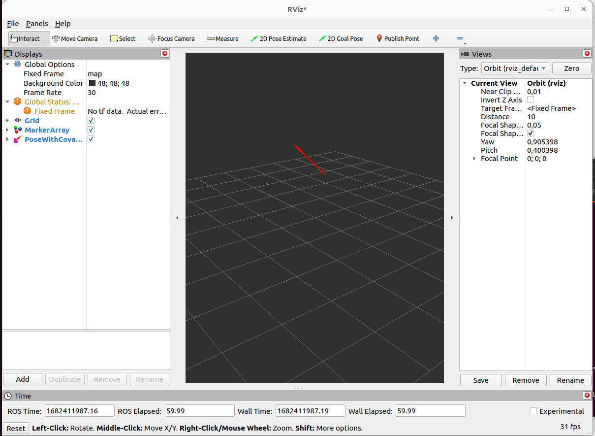

.. _tutorials:

Tutorials
#########

Optitrack system
*****************

1. Start the motive software

2. Connect to the same network of mocap system

3. Copy the server address of the mocap system and your ip address then paste it in the following file: 

`mocap_optitrack_driver/config/mocap_optritrack_driver_params.yaml`

.. code-block:: yaml
 
    mocap_optitrack_driver_node:
        ros__parameters:
          connection_type: "Unicast" # Unicast / Multicast
          server_address: "198.17.0.120"
          local_address: "198.17.0.48"
          multicast_address: "239.255.42.99"
          server_command_port: 1510
          server_data_port: 1511
          ....

4. Launch mocap otitrack driver

.. code-block:: console
    
    ros2 launch mocap_optitrack_driver optitrack2.launch.py

5. Activate the mocap optitrack driver node

.. code-block:: console

    ros2 lifecycle set /mocap_optitrack_driver_node activate

6. Create markers in Rviz

.. code-block:: console

    mocap4ros2_ws$ source install/setup.bash
    ros2 run mocap_marker_viz mocap_marker_viz

7. Run Rviz2

.. code-block:: console

    rviz2 rviz2

+----------+
| |image1| +
+----------+ 